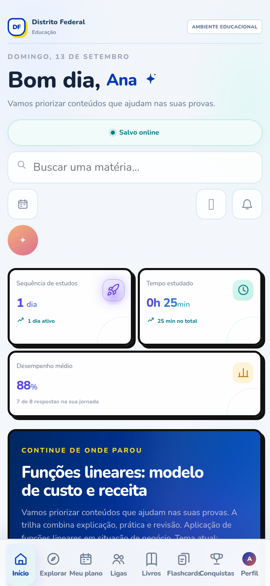
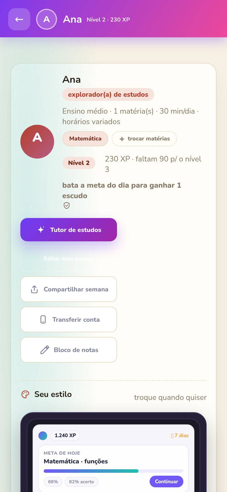
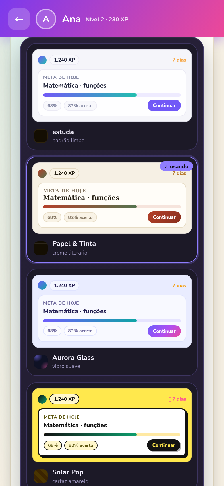

<!-- Banner -->

  

  

---

## 🚀 O que eu estou construindo

**[estuda+](https://estuda-mais-p6do.onrender.com)** — o plano de estudos que aprende com o aluno. Feito pro fundamental e médio, **[abrir o app →](https://estuda-mais-p6do.onrender.com)**

- 📋 plano do dia gerado pela IA a partir das matérias do aluno
- 🧠 tutor com memória que ensina passo a passo, em português
- 📚 biblioteca com clássicos na íntegra + tradução, e mangás
- 📡 offline-first: funciona sem internet e sincroniza depois
- 🔄 atualiza sozinho: instalou uma vez, nunca reinstala
- 💰 sem anúncios, sem cadastro chato, sem cobrar nada de ninguém

    

## 📊 O projeto em números

  
  
  
  
  

## 🛠️ Como eu construo

Node.js puro (zero framework, zero dependências) · HTML/CSS/JS na mão · PWA com service worker · testes e2e com Puppeteer · CI no GitHub Actions · deploy no Render

## 🤝 Dev Legends

Faço parte do **Dev Legends** — squad de amigos codando junto desde 2025. Full-stack, projetos de verdade e ninguém trava sozinho. 💥

---

💜 feito no Brasil · <i>estuda+</i>

